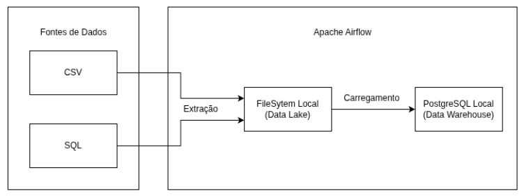
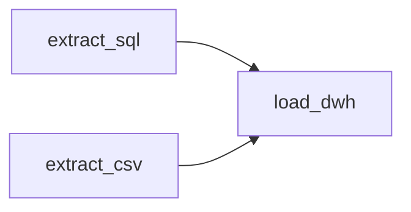

# 💾 Data Enginner Challenge - **Indicium**

## 📋 Sobre

Implementação de uma **pipeline ETL**(Extract, Transform, Load) para o Banco Vitória(um banco fictício) utilizando Apache Airflow para orquestração de fluxos de trabalho e Docker para infraestrutura.

## 📌 Pré-requisitos e Execução

- [Python](https://www.python.org/downloads/)
- [Docker](https://www.docker.com/)
- [Docker Composer](https://docs.docker.com/compose/install/)
- [Git](https://git-scm.com/downloads)

---

1. ### Clonar o repositório

```bash
git clone git@github.com:gabriel-am12/indicium_DE_challenge.git
```

2. ### Subir os serviços

```bash
docker-compose up -d
```

3. ### Acessar o Airflow Webserver

```bash
http://localhost:8080
(usuário e senha = airflow)
```

4. ### Configure as Conexões do Airflow(Admin -> Connections)

```bash
Connection Id: banvic_source_db

Connection Type: Postgres

Host: db

Database: banvic

Login: data_engineer

Password: v3rysecur&pas5w0rd

Port: 5432
```

```bash
Connection Id: banvic_dwh

Connection Type: Postgres

Host: dwh

Database: banvic_dwh

Login: data_engineer

Password: v3rysecur&pas5w0rd

Port: 5432
```

5. ### Habilitar (unpause) a DAG e dar um Trigger para o primeiro teste.

6. ### Verificar

- Se houve criação da pasta correspondente ao dia (YYYY-MM-DD) em `extracted_Data`
- As tabelas no Data Warehouse(`banvic_dwh`)

## ✔️ Requisitos Implementados

- Extrações idempotentes(Pode ser realizado mais de uma vez, o resultado será o mesmo)
- Todos os dados foram extraidos com sucesso nos testes.
- Dados são salvos no formato CSV no FileSystem Local(Data Lake), seguindo o padrão de nomenclatura:

```
<ano>-<mês>-<dia>/<fonte-de-dados>/<nome-da-tabela-ou-csv>.csv
```

- Paralelismo nas extrações
- A etapa de Load para o DWH só ocorre após todas as extrações terem sido concluidas.
- O pipeline será executado todos dias às 04:35 AM
- O projeto é repoduzível em outros ambientes.

## 📈 Diagrama do Projeto e Fluxograma do DAG Implementado



---


